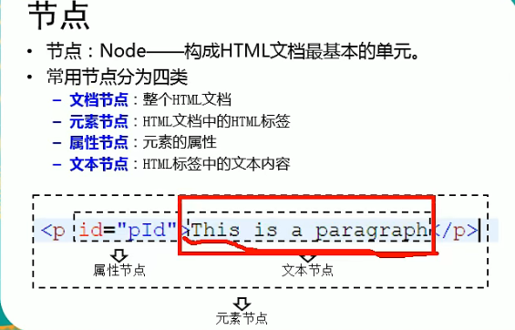
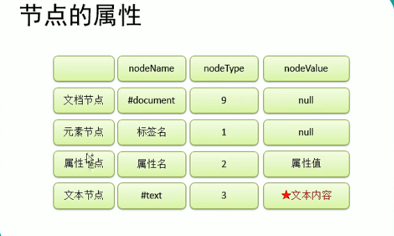

### 数据类型
1. String           使用单引号或者双引号修饰的数据  'a' "a"
2. Number           包括整型和浮点型以及Infinity -Infinity 和NaN
3. Boolean          只有两个值 true false
4. Object           {} 包括 null
5. Undefined        只有一个值 undefined
### 数据转换
1. 其他类型 --> String
    - 调用toString()方法(null和undefined不可用)
    - 使用String()函数(无限制)
2. 其他类型 --> Number
    - 使用Number()函数
        - true --> 1
        - false --> 0
        - null --> 0
        - 纯数字字符串(包括科学表达式) --> 对应数字
        - 其余均为NaN
    - 使用parseInt()函数
        - 数字开头的字符串(不包括科学表达式) --> 解析出第一个完整的数字
        - 其余均为NaN(包括Infinity和-Infinity)
    - 使用parseFloat()函数
        - 数字开头的字符串(包括科学表达式) --> 解析出第一个完整的数字
        - 其余均为NaN
3. 其他类型 --> Boolean(存在隐式类型转换)
    - String: 
        - 空字符 --> false
        - 其他 --> true
    - Number:
        - 0 --> false
        - -0 --> false
        - NaN --> false
        - 其他 --> true
    - Object:
        - null --> false
        - 其他 --> true
    - undefined: --> false
### Object(引用数据类型 其他是 基本数据类型)
1. 划分
    - 内建对象:由es标准提供 String Number Function Math
    - 宿主对象:由实现es标准的产品提供(主要指浏览器) console document window location
    - 自定义对象
2. 创建自定义对象
    - new 构造函数 new String() new Boolean() new Number() new Object()
    - 使用Object()函数
    - 赋值为{}
### 函数
1. 创建
    - 构造函数 new Function() 字符串传入代码
    - 匿名函数 let fnt = function() {} 函数体内写逻辑代码
    - 函数声明 function fnt() {} 函数体内写逻辑代码
2. this 指向函数调用的上下文
    - 如果直接调用 则this指向window
    - 如果作为对象的方法被调用 则this指向对象
    - 如果以构造函数形式调用 则this指向新创建的对象
### dom
0. html加载的顺序是从上到下逐行执行
1. 节点的分类
    - 文档节点 一个html为一个文档节点
    - 元素节点 html内的标签
    - 属性节点 标签的属性
    - 文本节点 html 和 标签 以及 属性内的文本数据
    - 
2. 节点的属性
    - 
### 其他
1. 使用unicode编码
    - js中使用 \u加16进制编码
    - html中使用 &#加10进制编码(将16进制转换为10进制)
2. 等值判断
    - == 和 != 会做自动类型转换
    - === 和 !== 不做自动类型转换
3. 赋值运算
    - 赋值基本数据类型 数据相互隔离 各不相等
    ```javascript
        let a = 333;
        let b = a;
        console.log(a, b);
        a = 4; // b不会改变
        console.log(a, b);
    ```
    - 赋值引用数据类型 数据共享
    ```javascript
        let o1 = {};
        let o2 = o1;
        console.log(o1, o2, o1 === o2);
        o1.id = 322; // o2也会改变
        console.log(o1, o2, o1 === o2);
        o2.name = '322'; // o1也会改变
        console.log(o1, o2, o1 === o2);
        o1 = { id: 422 }; // o2不会改变
        console.log(o1, o2, o1 === o2);
    ```